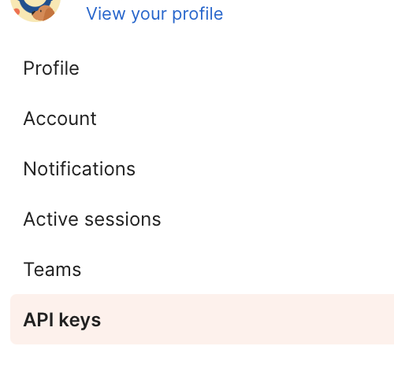
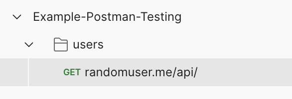
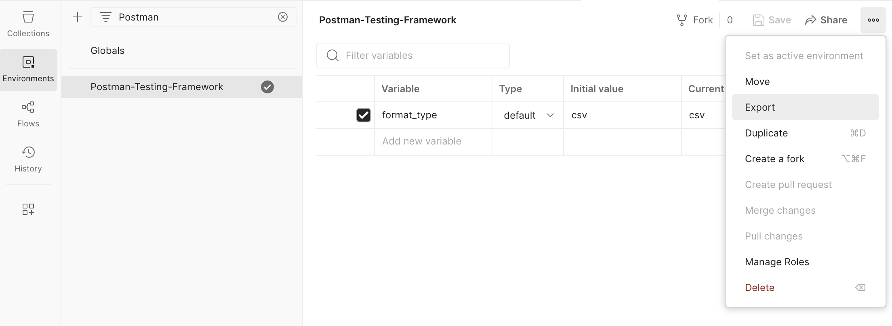
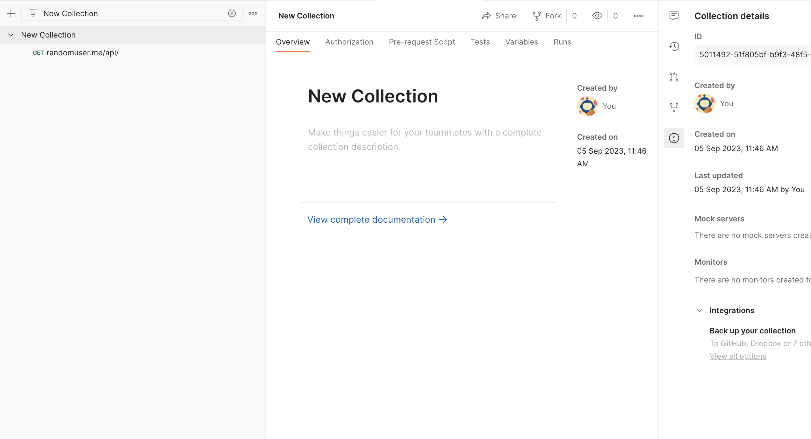

# Postman Testing Framework

📚 Boilerplate &amp; library for running tests on collections in postman. Very useful for testing APIs and hooking the tests into git workflows (eg. pre-commit, pre-push).

- 💨 In minutes, [get testing automations](#example---setup-cli-automation) via git hooks with postman using newman: Copy to your project the `/testing/` folder, `chmod +x testing/init.sh` and setup

- ✍️ [Get writing - with support.](#writing-tests) Eliminate a week's worth or more of time trying to work with scopes in postman's request, pre-request scripts, etc - and use our boilerplate that you can build off of.

---

[Postman](https://www.postman.com/) is an API platform for developers to design, build, test and iterate their APIs. 

👉 It is assumed **you have a postman account** and the permissions needed to add collections, folders, requests, pre-request scripts, and can create or obtain an API key in your profile settings.

🖊️ This repo is meant to help you author automated tests for your projects. It...

1. Contains how-to strategy and a JS library for writing the tests into postman GUI more efficiently.
2. Generates a `/testing/` folder that you can then copy and paste into your own project's repo to automate and integrate these tests into git pre-commit/pre-push hooks.

## Requirements

- [Postman](https://www.postman.com/) account
- uses `nvm`, and recommended to have `.nvmrc` in your project!
- uses the npm package `newman` to connect to postman to run the tests in CLI. _eg: nvm use && npm install -g newman_

---

## Get Started

Clone the project!

```
git clone https://github.com/amurrell/postman-testing-framework.git
```

First, familiarize yourself with [the concept of using collections for testing](#the-concept-of-using-collections-for-testing).

Follow these tutorials:

- [Setup CLI Automation](#example---setup-cli-automation)
- [Running Tests](#running-tests)
    - [Run 1 configuation](#run-1-configuration)
    - [Run automations](#run-automationsjson-multiple-configurations)
- [Git Hooks](#automation-with-git-hooks)
    - [Write scripts](#scriptsgit-hook)
- [Coming soon - Writing Tests](#writing-tests)
    - [Library - utils, funcs, etc](#libary-utils-funcs)

---

### The concept of using collections for testing

**Using Postman collections for automated testing** employs a strategy distinct from documenting API endpoints. Instead, think of it as a **separate collection** dedicated solely to testing, often referred to as a **"Test collection."** Here's what you need to know about test collections:

 - 👩‍💻 Each member of your development team can fork the collection and contribute tests for review and merging. This collection is tied to a unique environment to enable the use of globals and other dynamic data during testing.

- ↔️ It's essential to keep this collection separate from your normal project because the "tests" run in the order they are positioned, starting with the main folder you are testing within the collection. 

- 🗃️ It's recommended to organize your tests into folders by unit (e.g., service, app, platform, or topic) at the top level, and using additional flow-oriented folders as needed. Each individual request will contain the actual tests, which may require creating multiple requests for a single "endpoint" to cover different request bodies and expected results.

**Example of Test Collection Hierarchy Folders:**

🗂️ Test Collection → App Platform → As Customer → Auth & Onboarding

Running the tests from the Postman app is straightforward—simply **right-click on any folder and it runs the tests within them.**

Running them from the CLI and integrating with github hooks? Well that's what this repo is for! Read on...

[↑ Contents](#get-started)

---

### Example - Setup CLI Automation

✋ Before we setup the CLI automation, you want to familiarize yourself with [the concept of using collections for testing](#the-concept-of-using-collections-for-testing)

ℹ️ Even if you have an existing collection, you should make a copy of it exclusively for testing purposes and do the steps below with your copied collection in mind. 

- Create/Retrieve a Postman API key - to create, click your avatar in postman → settings → API Keys. 

    

- Add a New Collection, Folder, Request, and Environment
    
    Request: `GET https://randomuser.me/api/?format={{format_type}}` uses a variable we will define in the environment.

    

    Create & select your Environment - and then export it using 3 dot menu. Example in screenshot using a variable "format_type".

    

    [_🖼️ Full-Screen: environment.png_](docs/img/environment.png)

- Get collection ID - Click on your collection in navigation, and then click the info icon in far right pane. 
   
    
    
    [_🖼️ Full-Screen: collection-info.png_](docs/img/collection-info.png)

- If you have an environment in postman (where you store variables), you can export it

In the terminal, we will setup our collection, folder, environment, api keys etc. to generate config & automations.json.

```
cd testing
./init.sh
```

[↑ Contents](#get-started)

---

### Automation with Git Hooks

When you run the `init.sh` script from inside of `testing`, it will ask at the end if you want to copy a script in `scripts` to `../.git/hooks`.

The prompts will continue to guide you to ask which script in the folder (eg. git-hook is provided already) and the destination such as `pre-commit` or `pre-push`. These recommendations mean that before your commit or push succeeds, it could run the automations and if failed, won't go through with the commit.

You can avoid git hooks in situations if you want by doing:

```
git commit -m "my message" --no-verify
or
git push --no-verify
```

#### scripts/git-hook

This script runs what is in automations.json - so if you only want to run 1 test group, edit your automations.json file.

Feel free to write your own scripts and use the `./init` prompts around this topic to choose your own scripts and hooks. 

For example, you could write some that are meant to be processed in git workflows or on testing servers and not just locally for developers! You can use the script outside of git hooks and use it to evaluate exit status of ./run-automations.

[↑ Contents](#get-started)

---

### Running Tests

Once you've setup with the init.sh script, you can test out your tests!

#### Run 1 configuration:

```
cd testing
./run-tests -c <config-name>
```

Example Output:

```
...
==== 🏁 Running Postman Collection Folder: users

newman

Example-Postman-Testing

❏ users
↳ randomuser.me/api/
  GET https://randomuser.me/api/?format=csv [200 OK, 1.82kB, 170ms]

┌─────────────────────────┬────────────────────┬───────────────────┐
│                         │           executed │            failed │
├─────────────────────────┼────────────────────┼───────────────────┤
│              iterations │                  1 │                 0 │
├─────────────────────────┼────────────────────┼───────────────────┤
│                requests │                  1 │                 0 │
├─────────────────────────┼────────────────────┼───────────────────┤
│            test-scripts │                  0 │                 0 │
├─────────────────────────┼────────────────────┼───────────────────┤
│      prerequest-scripts │                  0 │                 0 │
├─────────────────────────┼────────────────────┼───────────────────┤
│              assertions │                  0 │                 0 │
├─────────────────────────┴────────────────────┴───────────────────┤
│ total run duration: 189ms                                        │
├──────────────────────────────────────────────────────────────────┤
│ total data received: 1.1kB (approx)                              │
├──────────────────────────────────────────────────────────────────┤
│ average response time: 170ms [min: 170ms, max: 170ms, s.d.: 0µs] │
└──────────────────────────────────────────────────────────────────┘
```

I have not written any tests yet! But you can see that it works (postman api key, collection, folder, environment - all worked!)

[↑ Contents](#get-started)

---

#### Run automations.json (multiple configurations)

This is simulating what the `scripts/git-hook` would do...

```
./run-automations
```

Example output:

```
==== ‣ Number of Automations: 1
==== ‣ Running Automation: users-origin
==== ‣ Command: ./run-tests -c users-origin
========== 🏁 Using Config: users-origin
========== ⏳ Using nvm - based on .nvmrc - to install newman
...
==== 🏁 Running Postman Collection Folder: users

newman

Example-Postman-Testing

❏ users
↳ randomuser.me/api/
  GET https://randomuser.me/api/?format=csv [200 OK, 1.82kB, 268ms]

┌─────────────────────────┬────────────────────┬───────────────────┐
│                         │           executed │            failed │
├─────────────────────────┼────────────────────┼───────────────────┤
│              iterations │                  1 │                 0 │
├─────────────────────────┼────────────────────┼───────────────────┤
│                requests │                  1 │                 0 │
├─────────────────────────┼────────────────────┼───────────────────┤
│            test-scripts │                  0 │                 0 │
├─────────────────────────┼────────────────────┼───────────────────┤
│      prerequest-scripts │                  0 │                 0 │
├─────────────────────────┼────────────────────┼───────────────────┤
│              assertions │                  0 │                 0 │
├─────────────────────────┴────────────────────┴───────────────────┤
│ total run duration: 289ms                                        │
├──────────────────────────────────────────────────────────────────┤
│ total data received: 1.1kB (approx)                              │
├──────────────────────────────────────────────────────────────────┤
│ average response time: 268ms [min: 268ms, max: 268ms, s.d.: 0µs] │
└──────────────────────────────────────────────────────────────────┘
==== ✅ Automation: users-origin - SUCCESS
```

[↑ Contents](#get-started)

---

## Writing Tests

You will find yourself repeating what you write in the tests, since each request can be so similar and test slightly different outputs. As a result, this repo will include a small library with room for you to grow your own utilities and functions for handling similarities in your tests.

Coming in next PR!

[↑ Contents](#get-started)

---

### Libary Utils Funcs

Coming soon!

I will add a folder `library` for these things.

[↑ Contents](#get-started)